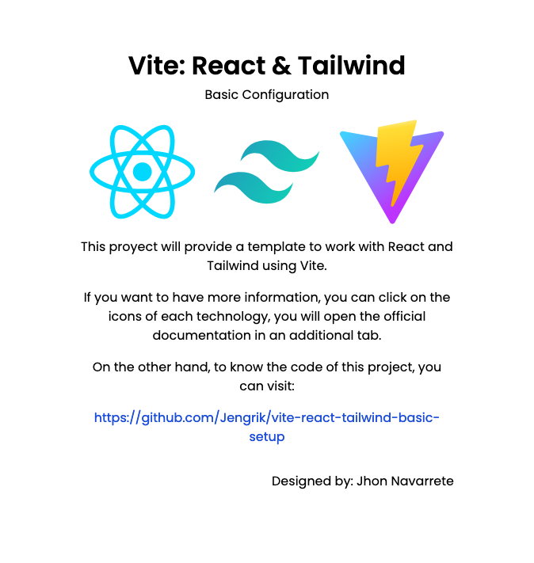

<div align="center">
    <h1>Vite: React & Tailwind</h1>
    <p> This project will provide a template to work with React and Tailwind using Vite. </p>
    <div style="display: flex; flex-direction: column; align-items: center;">
        <a href="https://github.com/Jengrik/Jengrik-VueJS-and-Webpack-Basic-Setup">
            
        </a>
        <p style="margin-bottom: 0;">Github Page</p>
        <a href="https://jengrik.github.io/vite-react-tailwind-basic-setup/">https://jengrik.github.io/vite-react-tailwind-basic-setup/</a>
    </div>
    <p align="right" style="margin-top: 30px;"><strong>Designed by: Jengrik</strong></p>
</div>
<br>
<h2 align="center">Screenshot</h2>
<div align="center">
    
    </div>
<br>
<h2 align="center">Getting Started</h2>

In a Vite project, you can work in two different modes: development and production. Each mode serves a specific purpose and has its own configuration settings. 

Understanding how to switch between these modes is essential for efficient development and deployment of your Vite project.

<h3>Development</h3>

1. To start your Vite project in development mode, open a terminal and navigate to the project's root directory.
2. Run the following command to install the project dependencies:

   ```bash npm install ```

   This will ensure that all required dependencies are installed.
3. Once the installation is complete, run the following command to start the development server:

    ```bash npm run dev ```

4. As you make changes to your project's source code, Vite will automatically update the browser with the latest changes without requiring a full page reload. This hot module replacement feature helps in faster development iterations.

<h3>Production</h3>

1. When you are ready to build your Vite project for production, open a terminal and navigate to the project's root directory.

    Run the following command to create a production-ready build:

    ```bash npm run build ```

    This command will generate an optimized bundle of your project in the dist directory.

2. Once the build process completes, you can deploy the contents of the dist directory to a static file hosting service or a web server of your choice.

3. The production build will have minimized and optimized code, ensuring faster loading times and better performance in a production environment.


<br>
<h2 align="center">References</h2>

This document is only a guide that aims to present the basic configuration of a simple project. The information was taken from the following sources:

- `Vite` <br>https://vitejs.dev/

- `React` <br>https://react.dev/

- `Tailwind` <br>https://tailwindcss.com/